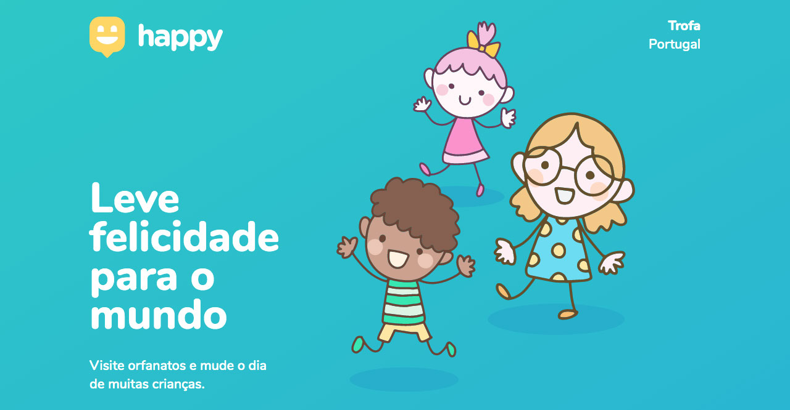

    🇺🇸&nbsp;&nbsp;<a href="README.md">Inglês</a>
    ·
    🇧🇷&nbsp;&nbsp;<a href="README-pt.md">Português</a>

<h1 align="center">
  
</h1>

Happy is an application developed during Rocketseat's Next Level Week #3.

  
  
  
  
  
  

  

## :memo: License

This project is under the **MIT** license.